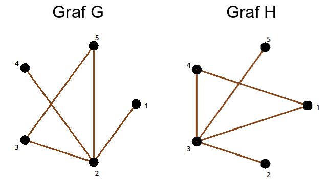
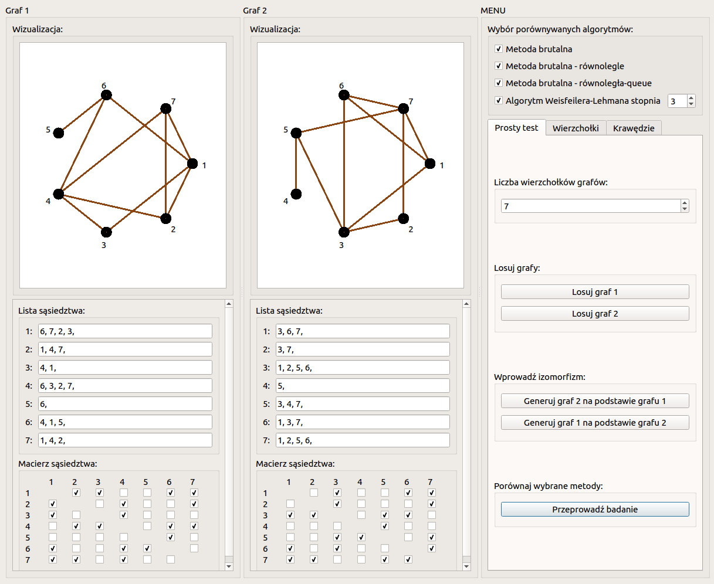
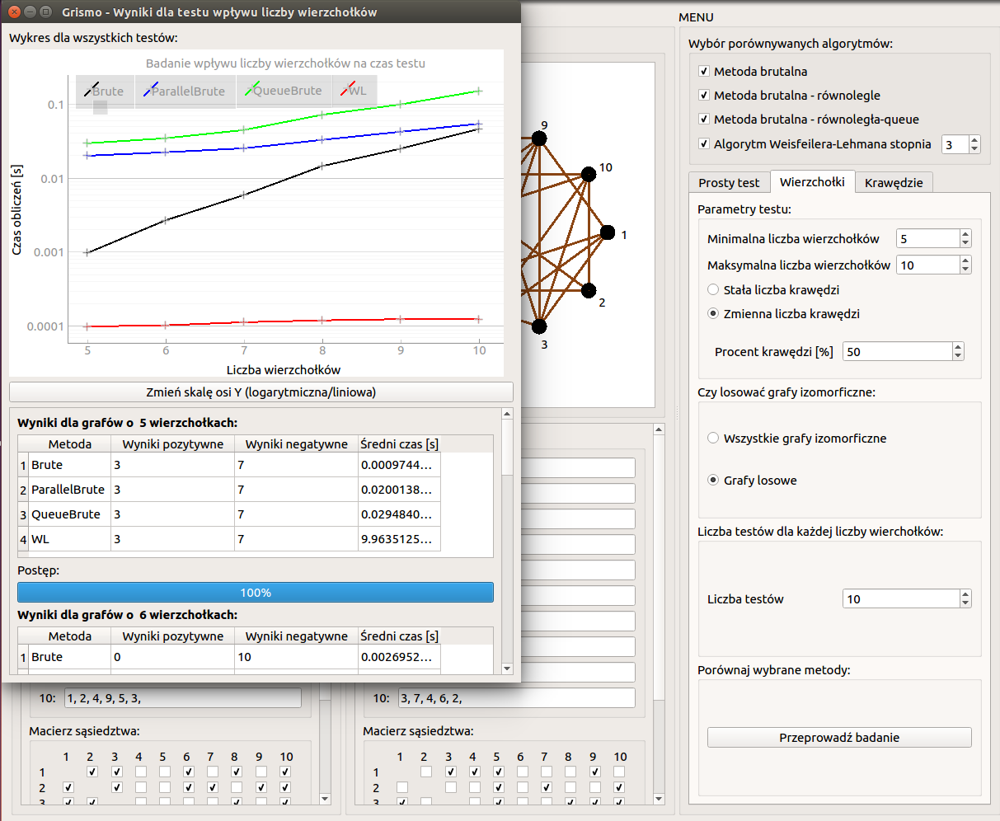

# GrismoR

Graph Isomorphism Problem Solver with Multiprocessing by Seweryn Panek Wrocław University of Science and Technology.

## Table of contents
* [GismoR](#grismor)
	* [Implemented algorithms](#implemented-algorithms)
	* [Types of tests](#types-of-tests)
	* [Setup](#setup)
	* [Usage](#usage)
* [Project](#project)
	* [Introduction](#introduction)
	* [Research problem](#research-problem)
	* [Description of the methods](#description-of-the-methods)
	* [Implementation](#implementation)
	* [Conducted research](#conducted-research)

## Implemented algorithms
-   Single-threaded brutal method,
-   Method based on BFS algorithm,
-   Method based on DFS algorithm,
-   Weisfeiler-Lehman's method,
-   Method based on graph spectrum comparison.

## Types of tests
-   single test for given graphs,
-   many tests for an increasing number of vertices,
-   many tests for an increasing number of edges.

## Setup
Clone this repo to your desktop and install all the dependencies.

## Usage
Just run command `python main.py` to run an application. Then choose in the right column type of test you want to conduct and it's parameters. If you want start a symulation click button "Przeprowadź badanie".

# Project

The aim of the project is to use multiprocessing algorithms to solve graph isomorphism problem.

## Introduction

A graph is a mathematical structure consisting of a set of vertices and a set of edges having ends at two selected vertices. It is used to present and describe relationships between objects.

A graph can be presented by set of vertices *V* and set of edges *E*, where *E = {{x, y}: x, y in V}*. Each edge is a pair of vertices which are neighbours. In labeled graph all vertices have unique number.

In this article all discussed graphs are simple, connected and symmetric. It means, that there are no multiple edges and no own loops, between any two vertices there is a path and if vertex *v_1* is a neighbour of vertex *v_2*, then vertex *v_2* is the neighbour of vertex *v_1*.

A graph can be represented by an adjacency matrix and an adjacency list. Adjacency matrices for all discussed graphs are square (0, 1)-matrices with zeros on diagonals. If in *i*-row and *j* column of an adjacency matrix there is 1, then vertices *v_i* and *v_j* are neighbours. If there is 0, then these vertices are not neighbours. An adjacency list represent a graph by a list of neighbours' labels for each vertex.

## Research problem

There is an isomorphism between two graphs when the vertices of one of them can be relabeled in such a way that the vertices in both graphs have exactly the same neighbors. An example of two isomorphic graphs is shown in Fig. below, where each vertex is given a corresponding label and in both graphs each vertex has exactly the same neighbors.

Research whether two graphs are isomorphic is the problem of isomorphism resolution. Graph isomorphism preserves all graph properties, for example: number of vertices, number of edges, and consistency. Therefore, isomorphic graphs are usually identified. In this paper two examined graphs will be called "graph *A*" and "graph *B*".

The problem of isomorphism resolution of two graphs belongs to the NP class, but has not yet been shown to be NP-complete. On the other hand, there are no known deterministic, probabilistic or quantum polynomial algorithms solving this problem. It is also not known whether the problem belongs to the co-NP class (complementary complexity class for NP decision problems).

### Problem formulation
The exact formulation of the problem consists in determining the input and output data of the algorithms that solve the problem.

Input data:
* Connected symmetric graphs *G* and *H* in the form of the neighborhood matrix *A_G* and *A_H*.

The output:
* True or false decision:  
	* true - if the examined pair of graphs is isomorphic,  
	* false - if the examined pair of graphs is not isomorphic.

## Description of the methods

For the purposes of this project, I proposed 3 types of brutal methods and one known algorithm from the literature:  
* brutal single-threaded method,  
* brutal method with parallel independent threads,  
* brutal method with parallel communicating threads,  
* Weisfeiler-Lehman algorithm (appendix).

### Brutal single-threaded method

In this method, for the graph *B*, all possible other graphs resulting from the change of the order of its vertices are generated.

For *n* vertices there is *n!* possible ways to arrange them in order. For each graph resulting from the rearrangements of the vertices of the graph *B*, a comparison is made with the graph *A* by comparing all neighbor relations in the adjacency matrix. The adjacency matrix is a square matrix with dimensions *n \times n*, so comparing two matrices has a square complexity.
Hence the computational complexity of the whole method is *O (n! \cdot n^2)*.

The creation of each vertex permutation is done vertex by vertex, i.e. the first vertex from the *n* unused vertices is drawn first, then the second from the *n-1* unused vertices until all vertices are used.

After each drawn vertex, a subgraph of the original graph is obtained. For example: after drawing only 5 vertices out of 10, we get a subgraph consisting of only 5 vertices.

To improve this method, algorithm compares the subgraphs at each stage. Thanks to this, it is possible to make an earlier decision about the lack of isomorphism for this draw - before the full permutation of vertices is drawn, the checked permutation will be interrupted and the next one starts.

In order to fully explain how to perform this method with the improvements applied, an example of calculations for the G and H graphs shown in Figure below.

An example of checking isomorphism using the brutal method:

| Investigated permutation (bijection_list) 	| Permutation's length (n) 	| The adjacency matrix of a subgraph formed of the first n vertices of G             	| The matrix of the neighborhood of a subgraph created from the vertices of the H graph according to the examined permutation 	| Are the adjacency matrices identical? 	|
|---------------------------------------	|--------------------------------	|-----------------------------------------------------------------------------------------	|------------------------------------------------------------------------------------------------------	|----------------------------------------	|
| [1]                                   	| 1                              	| [0]                                                                                     	| [0]                                                                                                  	| Tak                                    	|
| [1, 2]                                	| 2                              	| [0, 1; 1, 0]                                                                         	| [0, 0; 0, 0]                                                                                      	| Nie                                    	|
| [1, 3]                                	| 2                              	| [0, 1; 1, 0]                                                                         	| [0, 1; 1, 0]                                                                                      	| Tak                                    	|
| [1, 3, 2]                             	| 3                              	| [0, 1, 0; 1, 0, 1; 0, 1, 0]                                                       	| [0, 1, 0; 1, 0, 1; 0, 1, 0]                                                                    	| Tak                                    	|
| [1, 3, 2, 4]                          	| 4                              	| [0, 1, 0, 0; 1, 0, 1, 1; 0, 1, 0, 0; 0, 1, 0, 0]                               	| [0, 1, 0, 1; 1, 0, 1, 1; 0, 1, 0, 0; 1, 1, 0, 0]                                            	| Nie                                    	|
| [1, 3, 2, 5]                          	| 4                              	| [0, 1, 0, 0; 1, 0, 1, 1; 0, 1, 0, 0; 0, 1, 0, 0]                               	| [0, 1, 0, 0; 1, 0, 1, 1; 0, 1, 0, 0; 0, 1, 0, 0]                                            	| Tak                                    	|
| [1, 3, 2, 5, 4]                       	| 5                              	| [0, 1, 0, 0, 0; 1, 0, 1, 1, 1; 0, 1, 0, 0, 1; 0, 1, 0, 0, 0; 0, 1, 1, 0, 0] 	| [0, 1, 0, 0, 0; 1, 0, 1, 1, 1; 0, 1, 0, 0, 0; 0, 1, 0, 0, 0; 0, 1, 0, 0, 0]              	| Nie                                    	|
| [1, 3, 4]                             	| 3                              	| [0, 1, 0; 1, 0, 1; 0, 1, 0]                                                       	| [0, 1, 1; 1, 0, 1; 1, 1, 0]                                                                    	| Nie                                    	|
| [1, 3, 5]                             	| 3                              	| [0, 1, 0; 1, 0, 1; 0, 1, 0]                                                       	| [0, 1, 0; 1, 0, 1; 0, 1, 0]                                                                    	| Tak                                    	|
| [1, 3, 5, 2]                          	| 4                              	| [0, 1, 0, 0; 1, 0, 1, 1; 0, 1, 0, 0; 0, 1, 0, 0]                               	| [0, 1, 0, 0; 1, 0, 1, 1; 0, 1, 0, 0; 0, 1, 0, 0]                                            	| Tak                                    	|
| [1, 3, 5, 2, 4]                       	| 5                              	| [0, 1, 0, 0, 0; 1, 0, 1, 1, 1; 0, 1, 0, 0, 1; 0, 1, 0, 0, 0; 0, 1, 1, 0, 0] 	| [0, 1, 0, 0, 1; 1, 0, 1, 1, 1; 0, 1, 0, 0, 0; 0, 1, 0, 0, 0; 1, 1, 0, 0, 0]              	| Nie                                    	|
| [1, 3, 5, 4]                          	| 4                              	| [0, 1, 0, 0; 1, 0, 1, 1; 0, 1, 0, 0; 0, 1, 0, 0]                               	| [0, 1, 0, 1; 1, 0, 1, 1; 0, 1, 0, 0; 1, 1, 0, 0]                                            	| Nie                                    	|
| [1, 4]                                	| 2                              	| [0, 1; 1, 0]                                                                         	| [0, 1; 1, 0]                                                                                      	| Tak                                    	|
| [1, 4, 2]                             	| 3                              	| [0, 1, 0; 1, 0, 1; 0, 1, 0]                                                       	| [0, 1, 0; 1, 0, 0; 0, 0, 0]                                                                    	| Nie                                    	|
| [1, 4, 3]                             	| 3                              	| [0, 1, 0; 1, 0, 1; 0, 1, 0]                                                       	| [0, 1, 1; 1, 0, 1; 1, 1, 0]                                                                    	| Nie                                    	|
| [1, 4, 5]                             	| 3                              	| [0, 1, 0; 1, 0, 1; 0, 1, 0]                                                       	| [0, 1, 0; 1, 0, 0; 0, 0, 0]                                                                    	| Nie                                    	|
| [1, 5]                                	| 2                              	| [0, 1; 1, 0]                                                                         	| [0, 0; 0, 0]                                                                                      	| Nie                                    	|
| [2]                                   	| 1                              	| [0]                                                                                     	| [0]                                                                                                  	| Tak                                    	|
| [2, 1]                                	| 2                              	| [0, 1; 1, 0]                                                                         	| [0, 0; 0, 0]                                                                                      	| Nie                                    	|
| [2, 3]                                	| 2                              	| [0, 1; 1, 0]                                                                         	| [0, 1; 1, 0]                                                                                      	| Tak                                    	|
| [2, 3, 1]                             	| 3                              	| [0, 1, 0; 1, 0, 1; 0, 1, 0]                                                       	| [0, 1, 0; 1, 0, 1; 0, 1, 0]                                                                    	| Tak                                    	|
| [2, 3, 1, 4]                          	| 4                              	| [0, 1, 0, 0; 1, 0, 1, 1; 0, 1, 0, 0; 0, 1, 0, 0]                               	| [0, 1, 0, 0; 1, 0, 1, 1; 0, 1, 0, 1; 0, 1, 1, 0]                                            	| Nie                                    	|
| [2, 3, 1, 5]                          	| 4                              	| [0, 1, 0, 0; 1, 0, 1, 1; 0, 1, 0, 0; 0, 1, 0, 0]                               	| [0, 1, 0, 0; 1, 0, 1, 1; 0, 1, 0, 0; 0, 1, 0, 0]                                            	| Tak                                    	|
| [2, 3, 1, 5, 4]                       	| 5                              	| [0, 1, 0, 0, 0; 1, 0, 1, 1, 1; 0, 1, 0, 0, 1; 0, 1, 0, 0, 0; 0, 1, 1, 0, 0] 	| [0, 1, 0, 0, 0; 1, 0, 1, 1, 1; 0, 1, 0, 0, 1; 0, 1, 0, 0, 0; 0, 1, 1, 0, 0]              	| Tak, izomorfizm potwierdzony           	|

### Brutal method with parallel independent threads

In this method, it is necessary to run n processes that will check for possible vertex permutations in such a way that the i-th process will assume that the i-th vertex on H is the first vertex on G.

This check will be done in exactly the same way as in the method without parallel computations - in a pessimistic case it is possible to do (n-1)! comparisons of the neighborhood matrix on n parallel processes.

Here, the same improvement as in the non-parallel computation method will be applied, i.e. the subgraphs on each partial vertex permutation will be compared, which will significantly reduce the number of full permutations tested - the isomorphism can be excluded much earlier, which will speed up the review of vertex permutations.

If one of the processes finds such a permutation of the vertices of the H graph, for which the same neighborhood relations are obtained as in the G graph, then the isomorphism of both graphs is found and all other processes can be terminated immediately.

An example of this method for G and H graphs from previous example is presented in table below. Permutations are bold, the finding of which confirms the occurrence of the isomorphism - when thread 2 or thread 5 calculates these permutations, then the entire program will be able to terminate the operation (all threads will be able to abort computation, so not all permutations listed in the table will be checked).

An example of performing parallel computations in the brute-force method:

| Permutations investigated by thread 1 |   | Permutations investigated by thread  2 |   | Permutations investigated by thread  3 |   | Permutations investigated by thread  4 |   | Permutations investigated by thread  5 |   |
|---------------------------------|---|---------------------------------|---|---------------------------------|---|---------------------------------|---|---------------------------------|---|
| [1]                             |   | [2]                             |   | [3]                             |   | [4]                             |   | [5]                             |   |
| [1, 2]                          |   | [2, 1]                          |   | [3, 1]                          |   | [4, 1]                          |   | [5, 1]                          |   |
| [1, 3]                          |   | [2, 3]                          |   | [3, 1, 2]                       |   | [4, 1, 2]                       |   | [5, 2]                          |   |
| [1, 3, 2]                       |   | [2, 3, 1]                       |   | [3, 1, 4]                       |   | [4, 1, 3]                       |   | [5, 3]                          |   |
| [1, 3, 2, 4]                    |   | [2, 3, 1, 4]                    |   | [3, 1, 5]                       |   | [4, 1, 5]                       |   | [5, 3, 1]                       |   |
| [1, 3, 2, 5]                    |   | [2, 3, 1, 5]                    |   | [3, 2]                          |   | [4, 2]                          |   | [5, 3, 1, 2]                    |   |
| [1, 3, 2, 5, 4]                 |   | [2, 3, 1, 5, 4]                 |   | [3, 2, 1]                       |   | [4, 3]                          |   | [5, 3, 1, 2, 4]                 |   |
| [1, 3, 4]                       |   |                                 |   | [3, 2, 4]                       |   | [4, 3, 1]                       |   |                                 |   |
| [1, 3, 5]                       |   |                                 |   | [3, 2, 5]                       |   | [4, 3, 2]                       |   |                                 |   |
| [1, 3, 5, 2]                    |   |                                 |   | [3, 4]                          |   | [4, 3, 2, 1]                    |   |                                 |   |
| [1, 3, 5, 2, 4]                 |   |                                 |   | [3, 4, 1]                       |   | [4, 3, 2, 5]                    |   |                                 |   |
| [1, 3, 5, 4]                    |   |                                 |   | [3, 4, 2]                       |   | [4, 3, 2, 5, 1]                 |   |                                 |   |
| [1, 4]                          |   |                                 |   | [3, 4, 5]                       |   | [4, 5]                          |   |                                 |   |
| [1, 4, 2]                       |   |                                 |   | [3, 5]                          |   |                                 |   |                                 |   |
| [1, 4, 3]                       |   |                                 |   | [3, 5, 1]                       |   |                                 |   |                                 |   |
| [1, 4, 5]                       |   |                                 |   | [3, 5, 2]                       |   |                                 |   |                                 |   |
| [1, 5]                          |   |                                 |   | [3, 5, 4]                       |   |                                 |   |                                 |   |

In summary - performing parallel computations has the following advantage:
* at the same time, vertex permutations are checked.

Data that is exchanged between processes:
* information whether no other process has already found isomorphism.

The disadvantages of this method:
* threads have a known permutation resource "in advance" to be checked. For example, if all but one thread finish checking their permutations, then they will finish and only the thread that hasn't finished checking will run - the ability to perform parallel computations is lost and the algorithm is no different from a single-threaded brute force method.

### Brutal method with parallel communicating threads

This method uses the idea of ​​studying partial permutations from the single-threaded brutal method. In order to enable parallel calculations, a pool of tasks to be performed is introduced, namely a pool of permutations common to all threads to be checked.

Each of the parallel processes gets the first possible permutation from the shared pool of tasks. If the subgraph of the graph H obtained from the vertex rearrangement according to the examined permutation has the same neighborhood matrix as the subgraph of the graph G composed of its first n vertices (where n is the permutation length), then all subsequent permutations are added to the task pool to be checked by adding to the examined the permutation of one selected vertex not used in the permutation. Otherwise, no permutation is added to the pool of tasks and the process can get another one for inspection.

Before starting processes, n permutations consisting of individual vertices are added to the pool of tasks.

An example of this algorithm implementation is presented in Table 3. G and H graphs from Figure 5 were used and it was assumed that the number of cooperating processes is 4.

The example ignores the fact that the processes may not run at the same speed. This is a deliberate effort to make it easier to present the example as simply as possible. The actual course of the algorithm will be different and depends on the speed of calculations by individual processes.

As it would be too extensive to present the full example, table below lists the first 4 operations performed by each of the four threads. In fact, the algorithm would be terminated when checked by one of the processes for permutations [2, 3, 1, 5, 4] or [5, 3, 1, 2, 4].

An example of a fragment of the brute force algorithm execution with parallel communicating threads:

| Process | Permutation pool before starting calculations                                                                                                                                                                        | Badana permutacja | Dołożone do puli permutacje     |
|---------|----------------------------------------------------------------------------------------------------------------------------------------------------------------------------------------------------------------------|-------------------|---------------------------------|
| 1       | [[1], [2], [3], [4], [5]]                                                                                                                                                                                            | [1]               | [1, 2], [1, 3], [1, 4], [1, 5]  |
| 2       | [[2], [3], [4], [5], [1, 2], [1, 3], [1, 4], [1, 5]]                                                                                                                                                                 | [2]               | [2, 1], [2, 3], [2, 4], [2, 5]  |
| 3       | [[3], [4], [5], [1, 2], [1, 3], [1, 4], [1, 5], [2, 1], [2, 3], [2, 4], [2, 5], [3, 1], [3, 2], [3, 4], [3, 5]]                                                                                                      | [3]               | [3, 1], [3, 2], [3, 4], [3, 5]  |
| 4       | [[4], [5], [1, 2], [1, 3], [1, 4], [1, 5], [2, 1], [2, 3], [2, 4], [2, 5], [3, 1], [3, 2], [3, 4], [3, 5], [4, 1], [4, 2], [4, 3], [4, 5]]                                                                           | [4]               | [4, 1], [4, 2], [4, 3], [4, 5]  |
| 1       | [[5], [1, 2], [1, 3], [1, 4], [1, 5], [2, 1], [2, 3], [2, 4], [2, 5], [3, 1], [3, 2], [3, 4], [3, 5], [4, 1], [4, 2], [4, 3], [4, 5]]                                                                                | [5]               | [5, 1], [5, 2], [5, 3], [5, 4]  |
| 2       | [[1, 2], [1, 3], [1, 4], [1, 5], [2, 1], [2, 3], [2, 4], [2, 5], [3, 1], [3, 2], [3, 4], [3, 5], [4, 1], [4, 2], [4, 3], [4, 5], [5, 1], [5, 2], [5, 3], [5, 4]]                                                     | [1, 2]            | brak                            |
| 3       | [[1, 3], [1, 4], [1, 5], [2, 1], [2, 3], [2, 4], [2, 5], [3, 1], [3, 2], [3, 4], [3, 5], [4, 1], [4, 2], [4, 3], [4, 5], [5, 1], [5, 2], [5, 3], [5, 4]]                                                             | [1, 3]            | [1, 3, 2], [1, 3, 4], [1, 3, 5] |
| 4       | [[1, 4], [1, 5], [2, 1], [2, 3], [2, 4], [2, 5], [3, 1], [3, 2], [3, 4], [3, 5], [4, 1], [4, 2], [4, 3], [4, 5], [5, 1], [5, 2], [5, 3], [5, 4], [1, 3, 2], [1, 3, 4], [1, 3, 5]]                                    | [1, 4]            | [1, 4, 2], [1, 4, 3], [1, 4, 5] |
| 1       | [[1, 5], [2, 1], [2, 3], [2, 4], [2, 5], [3, 1], [3, 2], [3, 4], [3, 5], [4, 1], [4, 2], [4, 3], [4, 5], [5, 1], [5, 2], [5, 3], [5, 4], [1, 3, 2], [1, 3, 4], [1, 3, 5]]                                            | [1, 5]            | brak                            |
| 2       | [[2, 1], [2, 3], [2, 4], [2, 5], [3, 1], [3, 2], [3, 4], [3, 5], [4, 1], [4, 2], [4, 3], [4, 5], [5, 1], [5, 2], [5, 3], [5, 4], [1, 3, 2], [1, 3, 4], [1, 3, 5]]                                                    | [2, 1]            | brak                            |
| 3       | [[2, 3], [2, 4], [2, 5], [3, 1], [3, 2], [3, 4], [3, 5], [4, 1], [4, 2], [4, 3], [4, 5], [5, 1], [5, 2], [5, 3], [5, 4], [1, 3, 2], [1, 3, 4], [1, 3, 5]]                                                            | [2, 3]            | [2, 3, 1], [2, 3, 4], [2, 3, 5] |
| 4       | [[2, 4], [2, 5], [3, 1], [3, 2], [3, 4], [3, 5], [4, 1], [4, 2], [4, 3], [4, 5], [5, 1], [5, 2], [5, 3], [5, 4], [1, 3, 2], [1, 3, 4], [1, 3, 5], [2, 3, 1], [2, 3, 4], [2, 3, 5]]                                   | [2, 4]            | brak                            |
| 1       | [[2, 5], [3, 1], [3, 2], [3, 4], [3, 5], [4, 1], [4, 2], [4, 3], [4, 5], [5, 1], [5, 2], [5, 3], [5, 4], [1, 3, 2], [1, 3, 4], [1, 3, 5], [2, 3, 1], [2, 3, 4], [2, 3, 5]]                                           | [2, 5]            | brak                            |
| 2       | [[3, 1], [3, 2], [3, 4], [3, 5], [4, 1], [4, 2], [4, 3], [4, 5], [5, 1], [5, 2], [5, 3], [5, 4], [1, 3, 2], [1, 3, 4], [1, 3, 5], [2, 3, 1], [2, 3, 4], [2, 3, 5]]                                                   | [3, 1]            | [3, 1, 2], [3, 1, 4], [3, 1, 5] |
| 3       | [[3, 2], [3, 4], [3, 5], [4, 1], [4, 2], [4, 3], [4, 5], [5, 1], [5, 2], [5, 3], [5, 4], [1, 3, 2], [1, 3, 4], [1, 3, 5], [2, 3, 1], [2, 3, 4], [2, 3, 5], [3, 1, 2], [3, 1, 4], [3, 1, 5]]                          | [3, 2]            | [3, 2, 1], [3, 2, 4], [3, 2, 5] |
| 4       | [[3, 4], [3, 5], [4, 1], [4, 2], [4, 3], [4, 5], [5, 1], [5, 2], [5, 3], [5, 4], [1, 3, 2], [1, 3, 4], [1, 3, 5], [2, 3, 1], [2, 3, 4], [2, 3, 5], [3, 1, 2], [3, 1, 4], [3, 1, 5], [3, 2, 1], [3, 2, 4], [3, 2, 5]] | [3, 4]            | [3, 4, 1], [3, 4, 2], [3, 4, 5] |

In summary - performing parallel computations has the following advantage:
* at the same time, vertex permutations are checked.

Data that is exchanged between processes:
* information if no other process has already found isomorphism,
the permutations left to be checked.

The disadvantages of this method:
* long delays associated with the shared resource, which is the common pool of permutations to be checked. References to the pool (getting tasks and adding new ones) are frequent, so there may be situations where a thread that still uses it waits for a resource to be released.

### Weisfeiler-Lehman's algorithm

First, all the vertices of both graphs are colored with the same color (a color can be represented by unique integer number). Then, for each vertex, a multi-set (set with repetitions) of the colors of its neighbors is created. Such pairs are saved for each graph, and if the graphs are isomorphic, identical sets of color pairs and the aforementioned multisets should be produced.

The next step is to recolor the vertices so that the two vertices have the same color only if they previously created the same color and multiset pair.

If the multisets of colors of both graphs are different, then the method determines the lack of isomorphism. Otherwise, the isomorphism has not been resolved.

Therefore, coloring and creating multi-color sets can be repeated in circles. If the obtained multisets of colors are identical after the duplications, then the result confirming the isomorphism of the examined graphs is returned.

It is then the Weisfeiler-Lehman's  algorithm of the *k* dimension. Note that it can state isomorphism when in fact the two graphs are not isomorphic. It has been proved, however, that this method correctly distinguishes all planar graphs for *k = 3*.

## Implementation

To carry out many tests, you need a tool in the form of a simulation program that examines the verdicts and times described in the previous chapters of the methods determining the isomorphism of graphs. In this chapter, the prepared tool used in this project will be described, as well as the implementation of individual algorithms.

### Programming language and libraries used

The programming language of choice is Python 3.7 due to the ease of implementation of selected issues and many ready-made libraries. The development environment used in the implementation of this project is PyCharm. The program interface was created using the PyQt5 library. Other libraries that provided ready-made mechanisms, incl. for time measurement and calculating the eigenvalues ​​of matrices are time, math, bisec, numpy. The pyqtgraph library was used to generate the charts. The multiprocessing library was used to introduce parallel calculations.

The code of the program prepared in this project can be downloaded from the following address: https://github.com/sewerus/grismoR.

The compiled file in .exe format can be downloaded using the Pyinstaller tool from the following address:
https://drive.google.com/file/d/1EFQKz2Ow0vaTOkqQMa90WXruHehwGK5u/view?usp=sharing

Please note, however, that all tests were performed in the Ubuntu 14.04 environment by running the program from the terminal via the command "python main.py". The .exe format program in Windows does not work properly for algorithms that use parallel calculations (probably the multiprocessing library is not adapted to the Windows environment).

### File structure description

`main.py`
A file describing the GrismoR class, which is responsible for the operation of the entire program as a desktop application. It describes the form that is displayed when the program is started.

`graph.py`
A file describing the Graph class. It is responsible for the visualization of the examined graphs.

`simple_graph.py`
A file describing the SimpleGraph class, which is responsible for the mathematical representation of the examined graphs. It includes methods such as obtaining a subgraph for a given vertex permutation, or comparing the adjacency matrix with another graph.

`isomorfism_test.py`
A file that describes the IsomopfismTest class. It is responsible for the execution of the tests. It implements a part of the program containing isomorphism checking algorithms.

`result_dialogs.py`
A file describing the classes responsible for displaying the results in the form of readable graphs. The program allows you to perform three possible types of tests and for each of them it is possible to display the results in a new application window.

`brute_process.py`
A file containing a function that is performed by brute-force processes with parallel independent processes.

`queue_process.py`
A file containing a function performed by brute-force processes with parallel communicating processes.

### Implementation of algorithms

#### Comparing the adjacency matrix of subgraphs for a given permutation
Graph manipulation methods have been implemented in the SimpleGraph class in the simple_graph.py file.

Knowing the permutation, according to which it is necessary to rearrange the vertices of a certain graph, we can call the subgraph_by_bijection (bijection_list) method on this graph.

If you want to compare the adjacent matrices of two graphs (including subgraphs), you can call the matrix_compare_to_another (another_graph) method on one of them, giving the second graph as an argument.

#### Single-threaded brutal method
The IsomorfismTest class describes the brute_try_fix (bijection_list) method. It's a self-calling function, a recursive algorithm. For the permutation given as an argument, the method checks whether the adjacent matrices of the obtained subgraphs are identical. If so, it invokes itself checking all possible permutations plus one vertex.

The function responsible for the brute-force method is brute_method (). It calls brute_try_fix (bijection_list) on an empty array. As a result, all possible vertex permutations are checked as described in the previous chapter.

#### Brutal method with parallel independent threads
This algorithm is implemented in the parallel_brute_method () function in the IsomofismTest class.

In this method, the only information exchanged between processes is whether an isomorphism has already been found. This information is stored in the confirmed_isomorphism variable.

In the next part the algorithm runs n processes that execute the pararell_brute_try_fix () function from the brute_process.py file (n is the number of vertices of the examined graphs). It is a recursive function that is a modification of brute_try_fix (bijection_list).

#### Brutal method with parallel communicating threads
This algorithm is implemented in the queue_brute_method () function in the Isomorfismtest class.

In this method, the only information exchanged between processes is whether an isomorphism has already been found. This information is stored in the confirmed_isomorphism variable. A shared pool of tasks (permutations to be checked) is introduced - this is the variable permutations_to_check. The third shared variable is_check_counter, which tells how many permutations should still be performed. It is increased by the number of permutations added to the pool and decreased by 1 each time the permutations from the pool are checked.

The algorithm runs n processes that execute the queue_worker_funcion () function in queue_process.py. Each process performs its own computation as long as the value of to_check_counter is greater than 0 and no isomorphism has been determined beforehand. If the examined permutation before a given thread yields consistent neighborhood matrices, then at the end of the queue further permutations are added, obtained by adding one vertex to the permutation just examined.

### Description of the functionality of the program

#### Graph input interface
To carry out a simple test, it is possible to enter graph 1 and graph 2 through the adjacency matrix represented by checkboxes. If the checkbox in a given cell is selected, then it represents the value of 1 in that cell. An unchecked checkbox represents the value 0. For the graphs introduced in this way, a neighborhood list and a visualization are generated. The number of vertices can be changed in the test settings in the right column of the program. Figure below shows a screenshot showing the two graphs entered for the simple test.

#### Testing interface
The parameters of the tests described in the previous chapter are entered in the form in the right column of the window. At the top, you can select methods by checking the checkboxes next to their names. For the Weisfeiler-Lehman method, a dimension selection is also possible here.

Then the type of test is selected, i.e. simple test, vertex number effect study, or edge number effect study.

#### The interface of the obtained results
For the simple test, the results are presented in the form of a table with the following columns: Method, Result, Time (in seconds). Additionally, the values from the Time column are presented on the graph with the possibility of changing the scale to linear / logarithmic.

The results for the tests examining the effect of the number of vertices and the effect of the number of edges are presented differently. For each number of examined vertices or edges, separate tables are generated with the following columns: Method, Positive results, Negative results, Average time (in seconds). The results from the Average Time columns are plotted on a graph with the option to change the scale to logarithmic / linear.

Thanks to a tool such as the simulation program, it is possible to carry out a large number of individual tests and obtain average results for a given number of vertices or edges. The results obtained thanks to this program and their interpretation will be described in the next chapter of this work.

## Conducted research

In order to check how the calculation time of each method changes depending on the number of vertices, a series of calculations was performed and the output data was interpreted. This allows for a comparison of the algorithms described in the previous chapters.

A laptop with an Intel Core i5-5200U processor (2 cores, 4 threads, 2.20-2.70 GHz, 3 MB cache) was used for testing.

### Test parameters
All methods were tested, that is:
* single-threaded brutal method (Brute),
* brutal method with parallel independent threads (ParallelBrute),
* brutal method with parallel communicating threads (QueueBrute),
* Weisfeiler-Lehman algorithm (WL, appendix).

The range of vertices of the generated graphs is: 4-28. The upper limit, 28 vertices, was chosen due to the long computation times. For each number of vertices, 50 pairs of graphs are drawn.

As the number of graph vertices increases, so does the number of edges. The ratio of graph edges to all possible edges for a given number of vertices is to be 50%.

It is not established whether the graphs selected for testing are isomorphic or not.

### Measurement of calculation times

For each number of vertices, 50 pairs of graphs were drawn, the isomorphism of which was checked using each algorithm. Figure and table below show the average measurement results of the calculation times of each method.

Conclusions from the obtained results:
* the brutal method with parallel communicating threads (QueueBrute) has the longest computation times for each number of nodes,
* for a small number of vertices (from 5 to 11) among the brutal methods, the fastest method is the one without parallel calculations (Brute),
* for a larger number of nodes (from 12 to 28) among the brutal methods, the method with parallel independent threads (ParallelBrute) is the fastest,
* the calculation times of the brutal methods from 12 to 28 vertices presented in the graph on a logarithmic scale have the shape of a straight line - this means that the calculation time increases exponentially,
* always the shortest computation time was obtained for the Weisfeiler-Lehman algorithm. The differences in the results for an increasing number of vertices are small, and it cannot be determined whether this is exponential growth.

Moreover, based on the results in table, it can be seen that the brute force method with parallel communicating threads (QueueBrute) for each number of nodes has about 2 times the computation time than the single-thread brute force method. Such a result can be obtained due to the insufficient profit obtained from parallel computing (the processor used has only 2 cores, 4 threads) and a lot of additional calculations needed to synchronize the processes. The introduced task pool and the permutation counter may introduce a significant delay in the performed algorithm.

| Vertices amount | Single-threaded brutal method | Brutal method with independent threads | Brutal method with communicating threads | Weisfeiler-Lehman algorithm |
|-----------------|-------------------------------|----------------------------------------|------------------------------------------|-----------------------------|
| 5               | 0,001034                      | 0,018744                               | 0,028172                                 | 0,000120                    |
| 6               | 0,002670                      | 0,022369                               | 0,037507                                 | 0,000131                    |
| 7               | 0,006319                      | 0,027534                               | 0,050755                                 | 0,000129                    |
| 8               | 0,012765                      | 0,033355                               | 0,069879                                 | 0,000157                    |
| 9               | 0,024038                      | 0,042008                               | 0,106192                                 | 0,000156                    |
| 10              | 0,047257                      | 0,062948                               | 0,183223                                 | 0,000187                    |
| 11              | 0,073961                      | 0,083773                               | 0,256997                                 | 0,000191                    |
| 12              | 0,131864                      | 0,114399                               | 0,369247                                 | 0,000206                    |
| 13              | 0,214498                      | 0,171331                               | 0,572927                                 | 0,000218                    |
| 14              | 0,334048                      | 0,246096                               | 0,833366                                 | 0,000232                    |
| 15              | 0,498484                      | 0,354056                               | 1,219281                                 | 0,000248                    |
| 16              | 0,745059                      | 0,509334                               | 1,703337                                 | 0,000314                    |
| 17              | 1,122649                      | 0,745718                               | 2,462126                                 | 0,000271                    |
| 18              | 1,611225                      | 1,047433                               | 3,436898                                 | 0,000320                    |
| 19              | 2,317697                      | 1,481793                               | 4,776406                                 | 0,000326                    |
| 20              | 3,239664                      | 2,046170                               | 6,517721                                 | 0,000311                    |
| 21              | 4,440667                      | 2,806661                               | 8,864692                                 | 0,000418                    |
| 22              | 6,113232                      | 3,804722                               | 11,849744                                | 0,000417                    |
| 23              | 8,235159                      | 5,108013                               | 16,303238                                | 0,000446                    |
| 24              | 10,632906                     | 6,617227                               | 21,462545                                | 0,000406                    |
| 25              | 14,528943                     | 8,988614                               | 28,704295                                | 0,000461                    |
| 26              | 19,218453                     | 11,853815                              | 38,103384                                | 0,000480                    |
| 27              | 24,164939                     | 14,879297                              | 47,213064                                | 0,000531                    |
| 28              | 31,344974                     | 19,365007                              | 61,809266                                | 0,000512                    |

### Observation of the processor's work
An important element of the study is also to observe how the processor threads work during the computation. The operating system used is Ubuntu 14.04. System Monitor allows you to observe the CPU usage with a graph and 4 series representing the percentage of CPU usage.

Figure below shows a fragment of the processor's work during calculations at 23 graph vertices. It can be clearly seen (from the left side of the graph) that only one thread was working for 20 seconds - these are calculations performed by the single-threaded brutal algorithm. Then all threads were running for about 8 seconds - this is a brute force computation with parallel independent threads. For the next 30 seconds, all threads were also working - this is a brute force computation with a pool of tasks (communicating threads).

